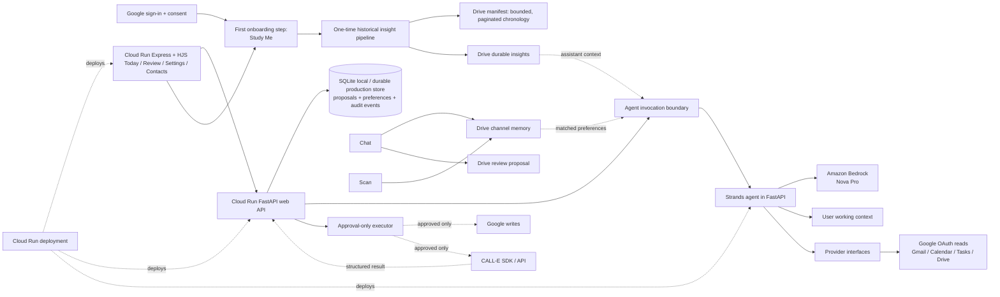

# OpenPip architecture

## Frontend source-of-truth and data rule

The travel-agent frontend and its marketing landing-page directory are copied verbatim and are the UI source of truth. Do not author a replacement frontend, navbar, view, or demo implementation. The production `frontend/` directory must never use demo data, mock data, fixtures, seeded records, or fake API responses; it renders connected provider data or an honest empty/error state only. Demo walkthroughs use a dedicated real account.

In local development, the Express server on `:5500` sends `/api` requests to
FastAPI and sends `/agent` requests through the OAuth session boundary on
`:4001`, which injects the signed-in token before forwarding to FastAPI on
`:5501`. Configure that boundary with `AGENT_URL=http://localhost:5501/agent`;
the legacy travel-agent service is never a valid target. Google provider reads
and Drive-backed app data remain owned by FastAPI.

The immutable system instructions define the agent’s tools and safety policy.
User-authored working context is a separate, editable input used to prioritize
work and match communication style. It cannot authorize an external action.

The Cloud Run FastAPI service hosts the Strands agent and remains responsible
for sessions, Google OAuth, polling, proposals, review, and approved
execution. Keeping the agent in the same service preserves the current user's
Google authorization, deterministic crawl/recovery state, and agentic memory
step without a remote runtime handoff. The Firebase-hosted landing page and
fictional `demo.openpip.me` walkthrough remain separate from the connected
application.

AgentCore was evaluated but is intentionally not part of this deployment. Its
separate runtime and identity boundaries are a poor fit for OpenPip's fully
customizable hybrid pipeline, and they are not a suitable place to express the
application's entire control flow. Daily record pagination and recovery are
deterministic, while the final memory synthesis is agentic and must share the
same per-user tools, proposal state, and approval executor. Splitting those
stages across a second runtime would add token-context and state handoffs,
duplicate coordination, and extra latency. This is an application-fit and
efficiency decision, not a limitation imposed by Google Cloud.

Every proposed action includes a source reference. The review lifecycle is:

`pending → approved/rejected → executing → executed/failed`

The executor is approval-gated and produces external side effects only after an
explicit approval. The Exec Assistant uses Calendar as context when deciding
whether an event specifically requires a phone call; it does not assume every
event belongs on the phone. A call proposal includes the exact requested
reschedule when applicable. After approval, the executor calls CALL-E through
its server API and records the structured result. The existing Calendar event
is updated only when the call succeeds and the provider confirms the new time;
failed calls or declined/unconfirmed reschedules leave it unchanged. Email and
direct Calendar workflows remain separate channel-specific behavior. CALL-E
does not need AgentCore-specific plumbing; it is an outbound provider used by
the executor. Chat transcripts are persisted separately from a small,
user-visible Drive-backed channel-memory store: the assistant can remember
that a specific business uses phone, email, text, or a booking system for a
specific situation. Chat, workspace-scan, and completed-interaction agents can
record explicit channel evidence from conversation, email, calendar, tasks,
contacts, and completed interactions. Channel memories are upserted by a
normalized subject and situation, so a later fact edits the matching memory
instead of creating a duplicate while different situations remain separate.
There are no AgentCore-specific integrations in the deployment. Cloud
Scheduler can trigger authenticated Cloud Run endpoints when background work
is needed. There are no mock providers or fake records in the actual
frontend.

The Dashboard's **Study Me** flow is the first onboarding step after sign-in and
Google consent. It is an onboarding/legacy-user pipeline, not a chat command.
The dashboard presents it before the assistant begins relying on historical
context, and it runs at most once after completion. Startup performs only
metadata boundary probes for Gmail, Calendar, and Drive, recording the oldest
and newest date for every collection type in the small
`OpenPip/memory/insights_gathering/manifest/metadata.json` pointer file. It
stores only the oldest/newest source dates, the global `oldestDate` and
`newestDate` bounds, the single `currentDate` processing/recovery pointer,
completed-date pointers, and recovery state; it never
stores indexed records. The worker advances one calendar day at a time from
`oldestDate` through `newestDate`; for each source record, the agent uses a
`read_historical_source` tool
to fetch the full record only for that individual processing pass. It stores
the index-only source id, date, reference, a very brief key-fact summary, and
`status: completed` in that day's `manifest/<date>.json` file. The date file is
updated after each record, so it is also the visible recovery checkpoint and
contains no raw message, document, or row content. After every record for a
date is indexed, the agent receives that date's summary set, can re-read exact
sources for precision, extracts durable memories, and advances to the next
date. Recovery retries only `in_progress` records. Explicitly documented
care-provider and appointment facts are allowed, while diagnoses and other
sensitive inferences are not.
