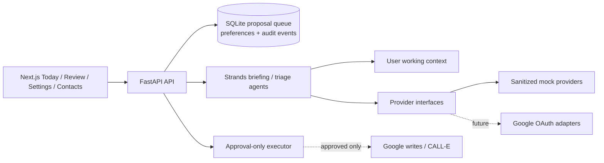

# OpenPip architecture

The immutable system instructions define the agent’s tools and safety policy.
User-authored working context is a separate, editable input used to prioritize
work and match communication style. It cannot authorize an external action.

Every proposed action includes a source reference. The review lifecycle is:

`pending → approved/rejected → executing → executed/failed`

The local executor is mock-only and produces no external side effects. Google,
CALL-E, AgentCore Identity, AgentCore Memory, and EventBridge adapters belong
behind the provider/executor interfaces as credentials become available.
