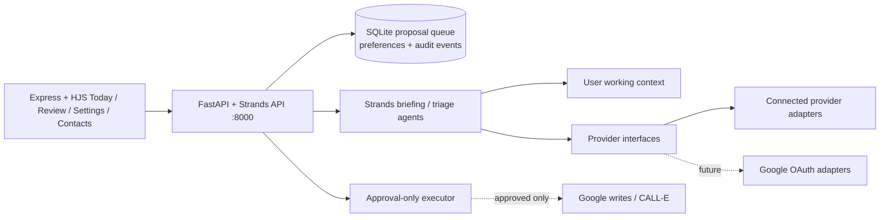

# OpenPip architecture

## Frontend source-of-truth and data rule

The travel-agent frontend and its marketing landing-page directory are copied verbatim and are the UI source of truth. Do not author a replacement frontend, navbar, view, or demo implementation. The production `frontend/` directory must never use demo data, mock data, fixtures, seeded records, or fake API responses; it renders connected provider data or an honest empty/error state only. Demo walkthroughs use a dedicated real account.

In local development, the Express server on `:4444` sends `/api` and
application `/agent` requests to the FastAPI + Strands service on `:8000`.
Only `/auth` is delegated to the separate OAuth callback/session service on
`:4001`; it is never an application or provider API target. Google provider
reads and Drive-backed app data are owned by FastAPI, which must receive the
signed-in token at its auth boundary. The legacy travel-agent proxy is never an
implicit target.

The immutable system instructions define the agent’s tools and safety policy.
User-authored working context is a separate, editable input used to prioritize
work and match communication style. It cannot authorize an external action.

Every proposed action includes a source reference. The review lifecycle is:

`pending → approved/rejected → executing → executed/failed`

The executor is approval-gated and produces external side effects only after an
explicit approval. Google, CALL-E, AgentCore Identity, AgentCore Memory, and
EventBridge adapters belong behind the provider/executor interfaces as
credentials become available. There are no mock providers or fake records in
the actual frontend.
